# 不规则四边形填充平面

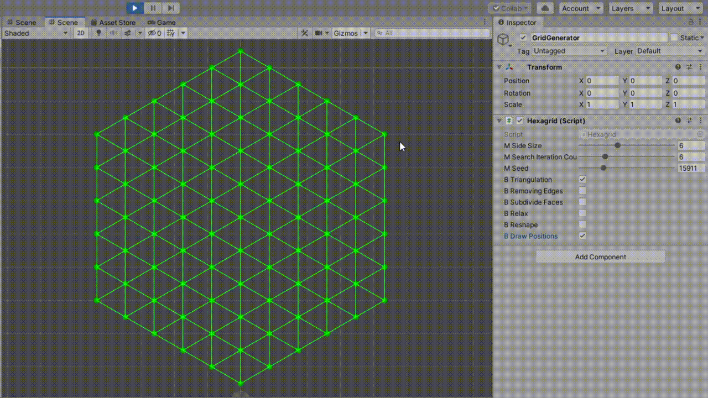

## 前言

[Townscaper](https://store.steampowered.com/app/1291340/Townscaper/)，一款关于城镇建造的游戏。

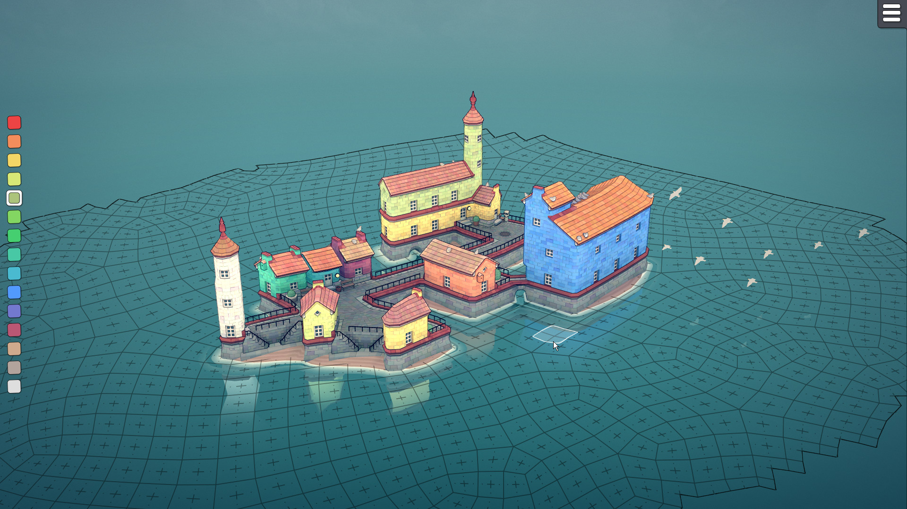

游戏基于一张用不规则凸四边形拼接而成的平面地图，其中每个四边形虽不规则，但又“接近”正方形，适合用于城镇的搭建。

本文将用 `Unity` 和 `C#` 实现这个算法，并逐步骤解释。

## 算法概述

算法分为如下三个步骤：

### 1. 把目标平面进行 Delaunay Triangulation

| 泊松分布的散点 | Delaunay 三角剖分 |
| -------------- | -------------- |
| 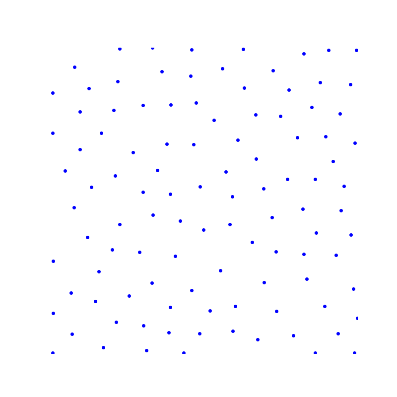 | 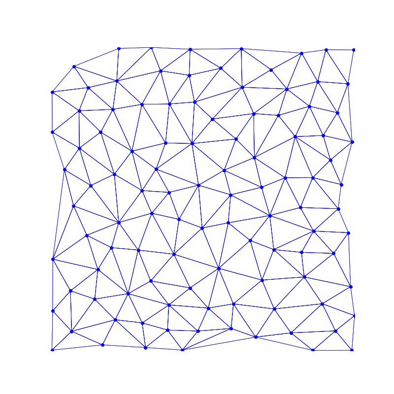 |

泊松分布+Delaunay 是为了获取尽量规整的三角形，

考虑到拼接无限地图的需求，此处的代码实现我们将用将 “正六边形” 三角形化的方式替代。

### 2. 随机剔除三角形的边

| Delaunay 三角剖分 | 剔除边后的平面 |
| -------------- | -------------- |
|  | 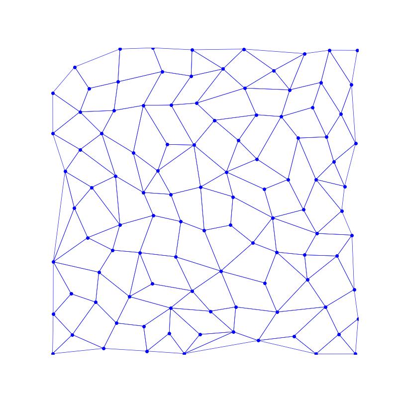 |

随机剔除三角形的边，使其和邻接三角形形成四边形。（本步骤不能保证所有三角形都被合并为四边形）

### 3. 将平面内的 “三角形” 和 “四边形” 细分为更小的四边形

我们需要仅由具有四个边的面组成的网格。但是我们当前的网格中仍然存在一些三角形。

不过，三角形可以很容易地细分为三个较小的四边形。同样，现有的四边形也可以细分为四个较小的四边形。如下图所示：

| 三角形 -> 四边形 | 四边形 -> 四边形 |
| -------------- | -------------- |
| 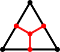 | 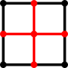 |

通过这样做，我们最终得到一个**仅由四边形组成**的网格。

| 三角形和四边形组成的平面 | 仅由四边形组成的平面 |
| -------------- | -------------- |
|  | 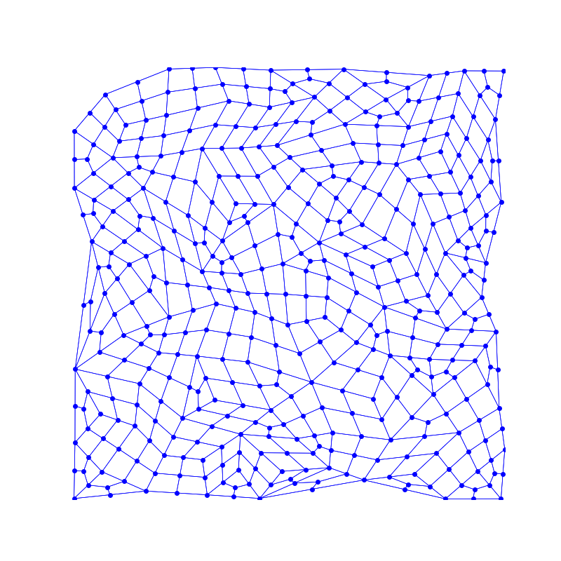 |

### 4. 让这些四边形形状更加松弛

这一步被称为 `Squaring` 或 `Relaxation`。

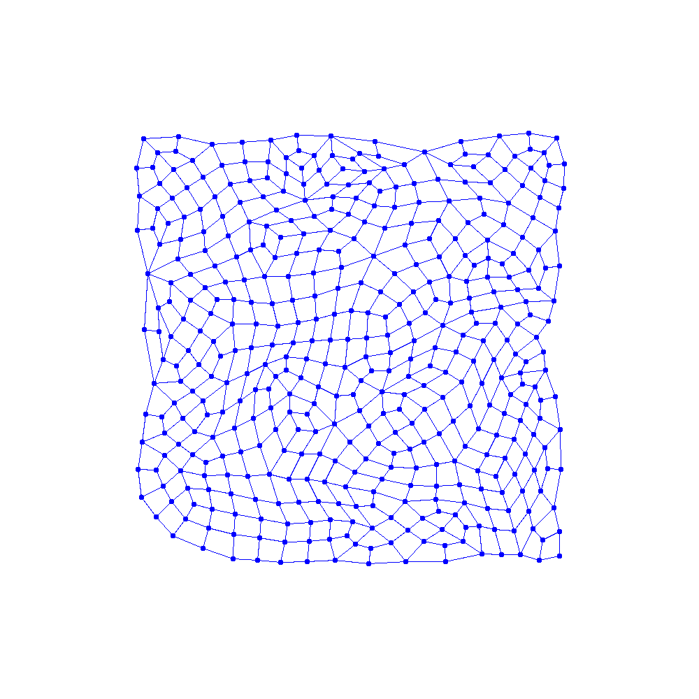

目的是为了让网格看起来更加“美观”，评判标准比较主观，有多种实现方式。

我们将采用将不断迭代每个顶点，将其移向相邻顶点中心的方式实现。

## 代码实现

### 0. 基础代码

新建一个 c# 脚本，派生于 MonoBehaviour，此处我们叫他 Hexagird.cs

```c#
[ExecuteInEditMode]
public class Hexagrid : MonoBehaviour
{
    void Start() ...
    void Update() ...
}
```

点、三角形、四边形 的抽象，便于后续代码实现。

```c#

class Point // 点
{
    public Vector2 mPosition;
    public bool mSide;  // 是否在六边形最外圈
};

class Triangle // 三角形
{
    public int mA, mB, mC;
    public bool mValid; // 用于剔除边的标记，剔除后赋值为 false
};

class Quad // 四边形
{
    public int mA, mB, mC, mD;
};

class Neighbours // “点” 所邻接的其他点
{
    public void Add(int i) ... // i 为邻接点索引
    public int count
    {
        get {
            return mNeighbour.Count;
        }
    }
    public List<int> mNeighbour;
};

```

最后给 `Hexagrid` 添加一些字段，用于控制生成参数，把脚本挂到场景内的一个空物体上。

```c#
[ExecuteInEditMode]
public class Hexagrid : MonoBehaviour
{
    [Range(2, 12)]
    public int mSideSize = 8;

    [Range(1, 20)]
    public int mSearchIterationCount = 12;

    [Range(0, 65535)]
    public int mSeed = 15911;

    private int mBaseQuadCount = 0;

    public bool bTriangulation = true;
    public bool bRemovingEdges = false;
    public bool bSubdivideFaces = false;
    public bool bRelax = false;
    public bool bReshape = false;
    public bool bDrawPositions = false;

    private List<Point> mPoints;
    private List<Triangle> mTriangles;
    private List<Quad> mQuads;
    private Neighbours[] mNeighbours;
    
    // 分别对应算法的四个步骤，先留空实现，慢慢补全
    void Triangulation() {}
    void RemovingEdges() {}
    void SubdivideFaces() {}
    void Relax() {}
    void Reshape() {} // 额外的轮廓相形
    
    // 绘图函数，不重要，从github把代码复制过来就行
    private void DrawLine(int a, int b) ...
    void OnDrawGizmos() ...
    
    // 当参数改变时，重新初始化
    private void OnValidate()
    {
        mPoints = new List<Point>();
        mTriangles = new List<Triangle>();
        mQuads = new List<Quad>();
        mNeighbours = new Neighbours[0];

        if (bTriangulation) {
            this.Triangulation();
        }
        if (bTriangulation && bRemovingEdges) {
            this.RemovingEdges();
        }
        if (bTriangulation && bRemovingEdges && bSubdivideFaces) {
            this.SubdivideFaces();
        }
    }
    
    // 重写 Update()，逐帧 Relax，方便看效果
    void Update()
    {
        if (bTriangulation && bRemovingEdges && bSubdivideFaces && bRelax) {
            if (bRelax) {
                this.Relax();
            }
            if (bRelax && bReshape) {
                this.Reshape();
            }
        }
    }
}
```

### 1. 三角形化

准备工作完成了，开始干正事：

```c#
void Triangulation()
{
    mPoints = new List<Point>();
    mTriangles = new List<Triangle>();
    mQuads = new List<Quad>();
    mNeighbours = new Neighbours[0];

    // 将六边形内散点坐标塞进 mPoints
    float sideLength = 0.5f * Mathf.Tan(Mathf.Deg2Rad * 60); // 0.5f* tanf(60deg)
    for (int x = 0; x < mSideSize * 2 - 1; ++x) {
        int height = (x < mSideSize) ? (mSideSize + x) : (mSideSize * 3 - 2 - x);
        float deltaHeight = mSideSize - height * 0.5f;
        for (int y = 0; y < height; y++) {
            bool isSide = x == 0 || x == (mSideSize * 2 - 2) || y == 0 || y == height - 1;
            mPoints.Add(new Point((x - mSideSize + 1) * sideLength, y + deltaHeight, isSide));
        }
    }

    // 分别给对称轴左右生成三角形（顶点顺序不同），塞进 mTriangles
    int offset = 0;
    for (int x = 0; x < (mSideSize * 2 - 2); x++) {
        int height = (x < mSideSize) ? (mSideSize + x) : (mSideSize * 3 - 2 - x);
        if (x < mSideSize - 1) {
            // left side
            for (int y = 0; y < height; y++) {
                mTriangles.Add(new Triangle(offset + y, offset + y + height, offset + y + height + 1));
                if (y >= height - 1) {
                    break;
                }
                mTriangles.Add(new Triangle(offset + y + height + 1, offset + y + 1, offset + y));
            }
        }
        else {
            // right side
            for (int y = 0; y < height - 1; y++) {
                mTriangles.Add(new Triangle(offset + y, offset + y + height, offset + y + 1));
                if (y >= height - 2) {
                    break;
                }
                mTriangles.Add(new Triangle(offset + y + 1, offset + y + height, offset + y + height + 1));
            }
        }
        offset += height;
    }
}
```

现在我们得到了存储在 `mPoints` 里的正六边形内顶点坐标，

以及存储在 `mTriangles` 里的三角形 index buffer.

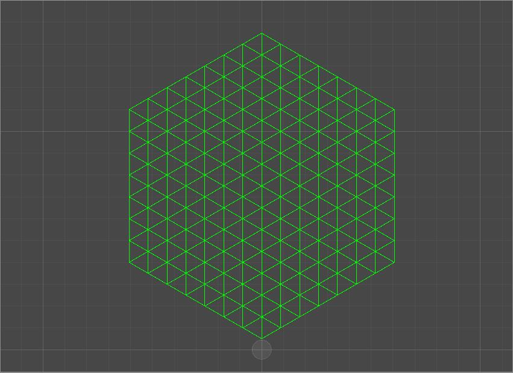

### 2. 剔除边

```c#
private int[] GetAdjacentTriangles(int triIndex);   // 获取邻接的三角形索引

void RemovingEdges()
{
    // triangles to quads
    System.Random rand = new System.Random(mSeed);
    while (true) {
        int triIndex;
        int searchCount = 0;
        do {
            triIndex = rand.Next() % mTriangles.Count;
            searchCount++;
        } while (searchCount < mSearchIterationCount && !mTriangles[triIndex].mValid);

        if (searchCount == mSearchIterationCount) {
            break;
        }

        int[] adjacents = GetAdjacentTriangles(triIndex);
        if (adjacents.Length > 0) {
            int i1 = triIndex;
            int i2 = adjacents[0];
            int[] indices = new int[6] {
                mTriangles[i1].mA, mTriangles[i1].mB, mTriangles[i1].mC,
                mTriangles[i2].mA, mTriangles[i2].mB, mTriangles[i2].mC
            };

            Array.Sort(indices);
            int[] unique = indices.Distinct().ToArray();
            Debug.Assert(unique.Length == 4);

            mQuads.Add(new Quad(unique[0], unique[2], unique[3], unique[1]));
            mTriangles[triIndex].mValid = false; ;
            mTriangles[adjacents[0]].mValid = false;
        }
    }
    this.mBaseQuadCount = mQuads.Count();
}
```

随机选择三角形，获取一个与其相邻的三角形，剔除一条公用边，更新 mValid 标记。

拼接成的四边形塞进 `mQuads`

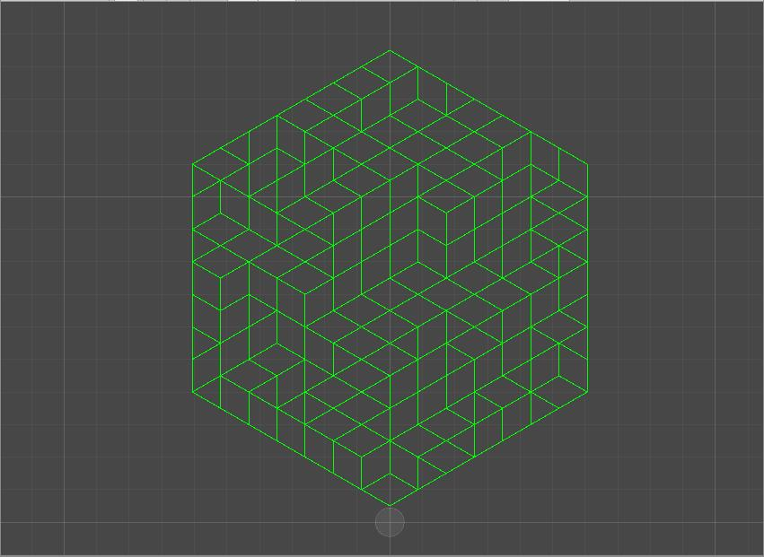

### 3. 细分成四边形

```c#
// 输入三角形/四边形顶点数组，和一个记录中点位置的字典
// 细分得到的顶点和四边形 index buffer 分别塞进 mPoints 和 mQuads 
void Subdivide(int[] indices, Dictionary<UInt32, int> middles);

void SubdivideFaces()
{
    Dictionary<UInt32, int> middles = new Dictionary<UInt32, int>();

    // quads to 4 quads
    for (int i = 0; i < mBaseQuadCount; i++) {
        var quad = mQuads[i];
        int[] indices = new int[4] {
            quad.mA, quad.mB, quad.mC, quad.mD
        };
        this.Subdivide(indices, middles);
    }

    // triangles to quads
    foreach (var triangle in mTriangles) {
        if (triangle.mValid) {
            int[] indices = new int[3] {
                triangle.mA, triangle.mB, triangle.mC
            };
            this.Subdivide(indices, middles);
        }
    }
}
```

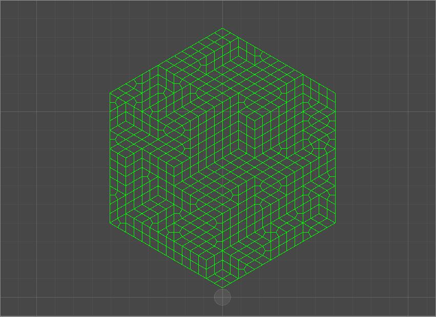

### 4. 使网格更加松弛

```c#
void Relax()
{
    mNeighbours = new Neighbours[mPoints.Count];
    for (int i = 0; i < mPoints.Count; ++i) {
        mNeighbours[i] = new Neighbours();
    }
    for (int i = mBaseQuadCount; i < mQuads.Count(); ++i) {
        var quad = mQuads[i];
        int[] indices = new int[4] {
            quad.mA, quad.mB, quad.mC, quad.mD
        };
        for (int j = 0; j < 4; j++) {
            int index1 = indices[j];
            int index2 = indices[(j + 1) & 3];
            {
                var neighbour = mNeighbours[index1];
                // check
                bool good = true;
                for (int k = 0; k < neighbour.count; k++) {
                    if (neighbour.mNeighbour[k] == index2) {
                        good = false;
                        break;
                    }
                }
                if (good) {
                    Debug.Assert(neighbour.count < 6);
                    neighbour.Add(index2);
                }
            }
            {
                var neighbour = mNeighbours[index2];
                // check
                bool good = true;
                for (int k = 0; k < neighbour.count; k++) {
                    if (neighbour.mNeighbour[k] == index1) {
                        good = false;
                        break;
                    }
                }
                if (good) {
                    Debug.Assert(neighbour.count < 6);
                    neighbour.Add(index1);
                }
            }
        }
    }

    for (int i = 0; i < mPoints.Count; i++) {
        if (mPoints[i].mSide) {
            continue;
        }
        var neighbour = mNeighbours[i];
        Vector2 sum = Vector2.zero;
        for (int j = 0; j < neighbour.count; j++) {
            sum += mPoints[neighbour.mNeighbour[j]].mPosition;
        }
        sum /= (float)neighbour.count;
        mPoints[i].mPosition = sum;
    }
}
```

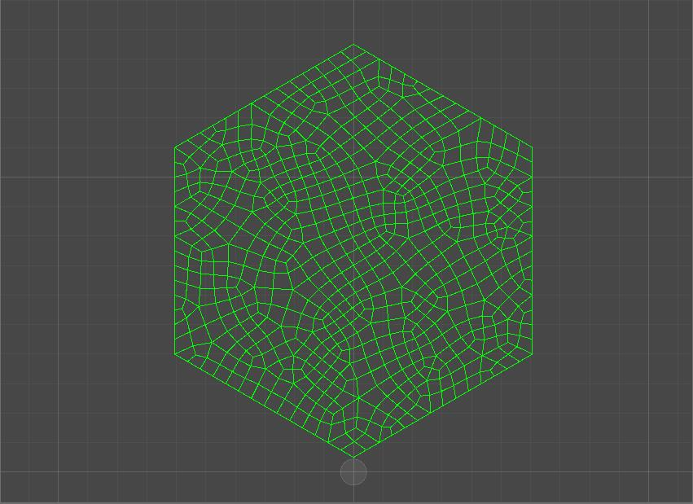

### 5. 还可以一定程度扭曲外轮廓

```c#
void Reshape()
{
    float radius = mSideSize - 1.0f;
    Vector2 center = new Vector2(0, (mSideSize * 2 - 1) * 0.5f);

    foreach (var point in mPoints) {
        if (!point.mSide) {
            continue;
        }
        Vector2 D = point.mPosition - center;
        float distance = radius - Mathf.Sqrt(D.x * D.x + D.y * D.y);
        point.mPosition += (D * distance) * 0.1f;
    }
}
```

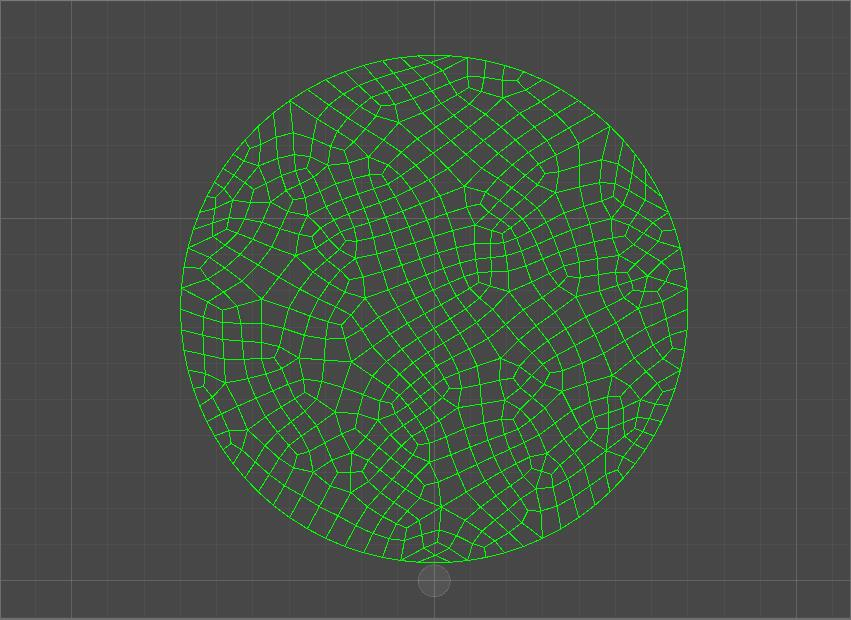